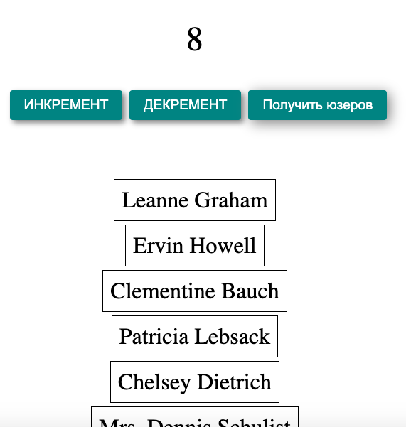

# React/Redux-Saga практика

Проект доступен по ссылке - https://redux-saga-practice.vercel.app/

## Стек   

- React    
- Redux-Saga  

Redux-Saga это middleware, который позволяет изменять состояние приложения с помощью асинхронный действий.  

Разобраны понятия Redux-Saga  

- workers  
- watchers  
- effects  
- функции-генераторы 

Воркер это функция-генератор, внутри воркера выполняется асинхронная логика. Вотчер это функция-генератор, в вотчерах с помощью эффектов указываются тип экшена и воркер, который будет отрабатывать, когда будет отрабатывать экшен с указанным типом. Эффекты это набор встроенных в Redux-Safa функций, которые помогают делать запросы, делать диспач, следить за воркерами. 

Функционал приложения: кнопки Инкремент и Декремент асинхронно изменяют состояние приложения - увеличивают и уменьшают состоние count. Кнопка Получить юзеров асинхронно изменяют состояние приложения users - делает запрос на сервер и отривовывает ответ от сервера в виде массива пользователей. 

    

  

  

